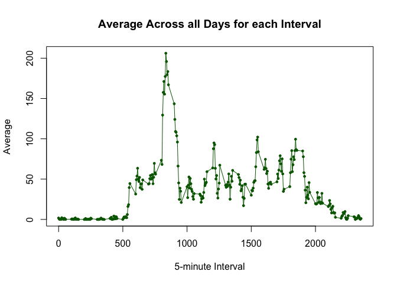
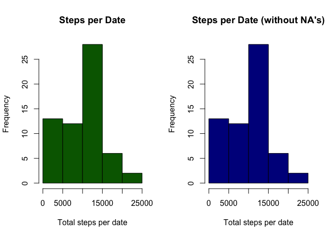
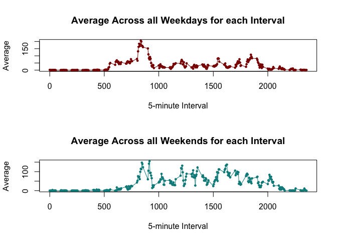

# Reproducible Research: Peer Assessment 1


## Loading and preprocessing the data


```r
unzip("activity.zip")
data <- read.csv("activity.csv", header=T, sep=",")
data$date <- as.Date(data$date)

library(knitr)
opts_chunk$set(fig.path="figure/")
```


## What is mean total number of steps taken per day?

First let's look at the steps per date data through an histogram.

```r
steps.per.date <- with(data, tapply(steps, date, sum, na.rm=T))
hist(
  steps.per.date,
  xlab="Steps per Date", ylab="Count",
  main="Steps per Date Histogram",
  col="blue"
)
```

<!-- -->

As per the mean and median, we have the following:

```r
mean(steps.per.date)
```

```
## [1] 9354.23
```

```r
median(steps.per.date)
```

```
## [1] 10395
```

## What is the average daily activity pattern?

First, we need to calculate the averages for each of the 5-min intervals. Then we'll plot it in a time-series plot.

```r
intervals <- unique(data$interval)
avg.per.interval <- with(data, tapply(steps, interval, mean, na.rm=T))

plot(
  intervals,
  avg.per.interval,
  xlab="5-minute Interval", ylab="Average",
  main="Average Across all Days for each Interval",
  col="darkgreen", type="l"
)
points(intervals, avg.per.interval, col="darkgreen", pch=19, cex=.5)
```

<!-- -->

As per the 5-min interval with the highest average of steps, we apply the `max` function to it:

```r
index <- which.max(avg.per.interval)
names(index)
```

```
## [1] "835"
```


## Imputing missing values

There are lots of records that don't contain valid data (i.e. `NA` values). Specifically:

```r
sum(is.na(data$steps))
```

```
## [1] 2304
```

To overcome this issue we'll fill in these `NA` values with the median for that specific 5-min interval where the data is missing.

```r
med.per.interval <- with(data, tapply(steps, interval, median, na.rm=T))

# We'll apply this replace function to all NA elements.
put.median <- function(steps, interval) {
  if (is.na(steps)) {
    steps <- med.per.interval[toString(interval)]
  }
  steps
}
steps.new <- with(data, mapply(put.median, steps, interval))

data.new <- data
data.new$steps <- steps.new
```

Now we need to measure the impact of imputting this data. For that we'll make a histogram of the total of steps taken each day. Then we'll calculate the **mean** and **median** of the total steps per day.


```r
par(mfrow=c(1, 2))

steps.per.date.new <- with(data.new, tapply(steps, date, sum, na.rm=T))

hist(
  steps.per.date,
  xlab="Total steps per date", main="Steps per Date",
  col="darkgreen")
hist(
  steps.per.date.new,
  xlab="Total steps per date", main="Steps per Date (without NA's)",
  col="darkblue")
```

<!-- -->

As we can see, these histograms look pretty similar, specially in the more dense sections.

As per the mean and median of the new filled data, we have the following:

```r
mean(steps.per.date.new)
```

```
## [1] 9503.869
```

```r
median(steps.per.date.new)
```

```
## [1] 10395
```

If we compare both sets of metrics, we'll see that the *median* does not present any changes, and the mean changes by only a bit:

```r
avg.old <- mean(steps.per.date)
avg.new <- mean(steps.per.date.new)
variation <- (avg.new - avg.old) / avg.old

library(scales)
percent(variation)
```

```
## [1] "1.6%"
```

## Are there differences in activity patterns between weekdays and weekends?

Let's analize the data taking into account the different days of the week. First we'll create a new column in our existing data frame (with the `NA` values removed) that indicates if the date is a weekday or not:

```r
dow <- weekdays(data.new$date)
dow <- sub("Monday", "weekday", dow)
dow <- sub("Tuesday", "weekday", dow)
dow <- sub("Wednesday", "weekday", dow)
dow <- sub("Thursday", "weekday", dow)
dow <- sub("Friday", "weekday", dow)
dow <- sub("Saturday", "weekend", dow)
dow <- sub("Sunday", "weekend", dow)

data.new$type.of.day <- dow
```

Now let's summarize the data based on this dimension and plot it as a time series:

```r
data.weekdays <- subset(data.new, type.of.day == "weekday")
avg.per.interval.weekdays <- with(data.weekdays, tapply(steps, interval, mean, na.rm=T))

data.weekends <- subset(data.new, type.of.day == "weekend")
avg.per.interval.weekends <- with(data.weekends, tapply(steps, interval, mean, na.rm=T))

par(mfrow=c(2, 1))

plot(
  intervals,
  avg.per.interval.weekdays,
  xlab="5-minute Interval", ylab="Average",
  main="Average Across all Weekdays for each Interval",
  col="darkred", type="l"
)
points(intervals, avg.per.interval.weekdays, col="darkred", pch=19, cex=.5)

plot(
  intervals,
  avg.per.interval.weekends,
  xlab="5-minute Interval", ylab="Average",
  main="Average Across all Weekends for each Interval",
  col="darkcyan", type="l"
)
points(intervals, avg.per.interval.weekends, col="darkcyan", pch=19, cex=.5)
```

<!-- -->
