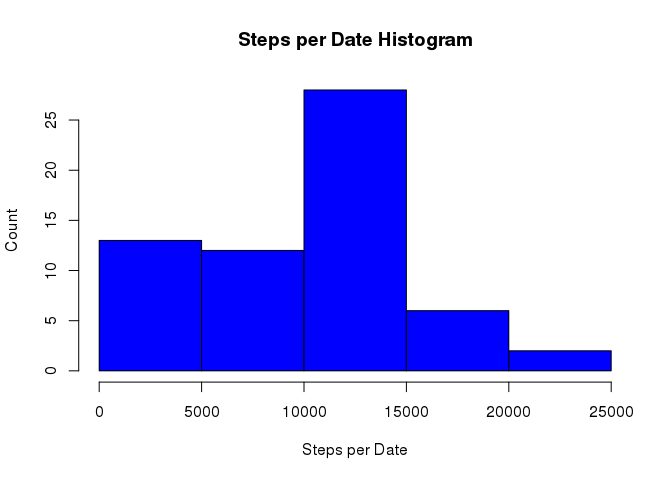
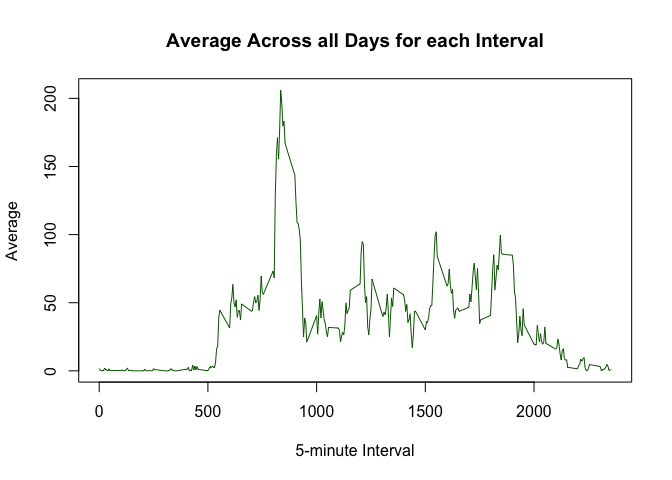

# Reproducible Research: Peer Assessment 1


## Loading and preprocessing the data


```r
unzip("activity.zip")
data <- read.csv("activity.csv", header=T, sep=",")
data$date <- as.Date(data$date)

library(knitr)
opts_chunk$set(fig.path="figure/")
```


## What is mean total number of steps taken per day?

First let's look at the steps per date data through an histogram.

```r
steps.per.date <- with(data, tapply(steps, date, sum, na.rm=T))
hist(
  steps.per.date,
  xlab="Steps per Date", ylab="Count",
  main="Steps per Date Histogram",
  col="blue"
)
```

<!-- -->

As per the mean and median, we have the following:

```r
mean(steps.per.date)
```

```
## [1] 9354.23
```

```r
median(steps.per.date)
```

```
## [1] 10395
```

## What is the average daily activity pattern?

First, we need to calculate the averages for each of the 5-min intervals. Then we'll plot it in a time-series plot.

```r
intervals <- unique(data$interval)
avg.per.interval <- with(data, tapply(steps, interval, mean, na.rm=T))

plot(
  intervals,
  avg.per.interval,
  xlab="5-minute Interval", ylab="Average",
  main="Average Across all Days for each Interval",
  col="darkgreen", type="l"
)
```

<!-- -->

As per the 5-min interval with the highest average of steps, we apply the `max` function to it:

```r
index <- which.max(avg.per.interval)
names(index)
```

```
## [1] "835"
```


## Imputing missing values


## Are there differences in activity patterns between weekdays and weekends?
